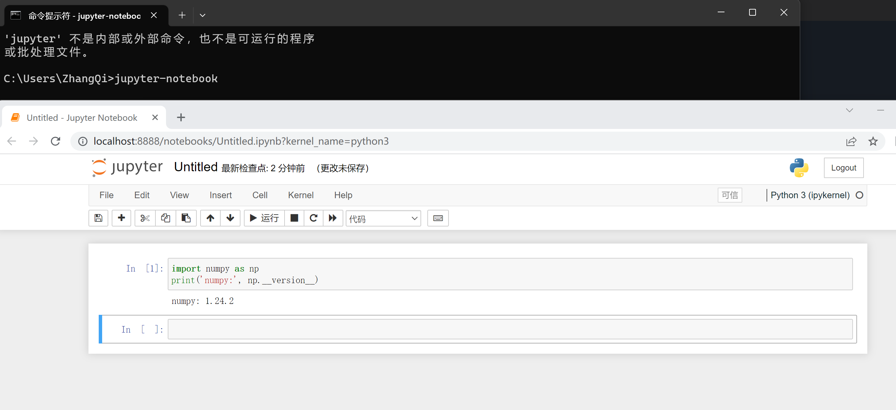
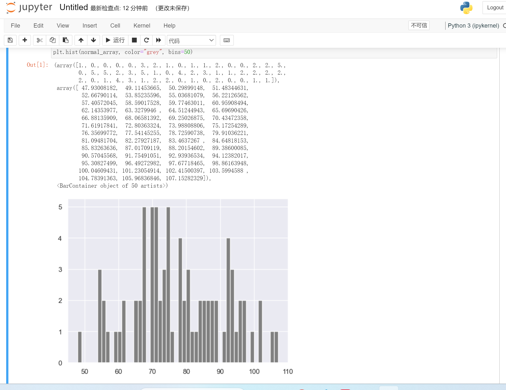
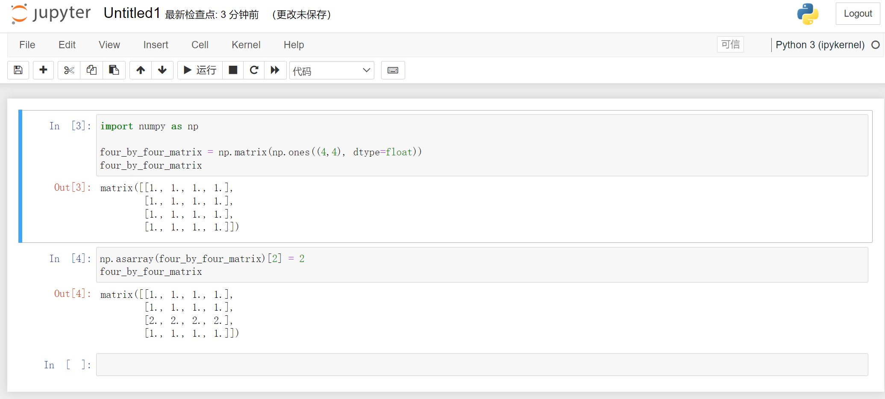

[<< Day 23](../23_Day_Virtual_environment/23_virtual_environment.md) | [Day 25 >>](../25_Day_Pandas/25_pandas.md)

- [📘 Day 24](#-day-24)
  - [Python统计分析](#Python统计分析)
  - [统计Statistics](#统计Statistics)
  - [数据](#数据)
  - [统计模型](#统计模型)
- [NumPy](#numpy)

# 📘 Day 24

## Python统计分析

## 统计Statistics

统计学是研究数据的收集、组织、显示、分析、解释和表示的学科。
统计学是数学的一个分支，被认为是数据和机器学习的先决条件。它是一个非常广泛的领域，但在我们的本篇的学习中值关心最相关的部分。
在完成本挑战后，你可以进行web开发、数据分析、机器学习和数据科学任何你感兴趣的方面深入学习。接下来让我们看看如果你需要处理一些数据，我们要怎么做把。  

## 数据

什么是数据？它是为了某种目的（通常是分析）而收集和转换的任何一组字符。数据可以是任何字符，包括文本和数字、图片、声音或视频。如果数据没有放在上下文中，那么它对人类或计算机来说就没有任何意义。为了从数据获得意义，我们使用不同的工具来处理数据。

数据分析、数据科学或机器学习的工作流程都是从数据开始的。可以从某些数据源提供数据，也可以创建数据。数据有结构化数据和非结构化。

数据可以是大小格式的。大多数数据类型已经在文件处理一节中介绍过。

## 统计模型

Python _statistics_ 模块提供了用于计算数值数据的数学统计的函数。该模块不打算成为 NumPy、SciPy 等第三方库的竞争对手，也不打算成为针对专业统计人员的专有全功能统计软件包(如Minitab、SAS和Matlab)的竞争对手。它的目标是绘图和科学计算器。

# NumPy

在第一节中，我们将 Python 定义为一种伟大的通用编程语言，但在其他流行库(numpy、scipy、matplotlib、pandas等)的帮助下，它成为科学计算的强大环境。

**NumPy** 是 Python 中科学计算的核心库。它提供了一个高性能的多维数组对象，以及用于处理数组的工具。

到目前为止，我们一直在使用vscode，但从现在开始，我建议使用 Jupyter Notebook。 官方地址 https://jupyter.org/ 可以使用在线IDE也可以本地安装
```sh
pip install notebook
jupyter-notebook
# 如果提示不是内部命令需要将pyhon安装目录下\Scripts配置到系统环境变量
```


安装numpy
```sh
$ pip install numpy
```

## 导入 NumPy

```py
import numpy as np
# 查看版本
print('numpy:', np.__version__)
# 查看可用的方法
print(dir(np))
```
输出
```shell
numpy: 1.24.2
['ALLOW_THREADS', 'AxisError',....
```

## 创建 numpy 数组

**int numpy**

```py
import numpy as np

# 创建 List
python_list = [1,2,3,4,5]

# 检查普通数组类型
print('Type:', type (python_list)) # <class 'list'>

print(python_list) # [1, 2, 3, 4, 5]

two_dimensional_list = [[0,1,2], [3,4,5], [6,7,8]]

print(two_dimensional_list)  # [[0, 1, 2], [3, 4, 5], [6, 7, 8]]

# 将普通list转成python numpy 数组
numpy_array_from_list = np.array(python_list)
print(type (numpy_array_from_list))   # <class 'numpy.ndarray'>
print(numpy_array_from_list) # array([1, 2, 3, 4, 5])
```

**float numpy**

Creating a float numpy array from list with a float data type parameter

```py
import numpy as np

# Python list
python_list = [1,2,3,4,5]

numy_array_from_list2 = np.array(python_list, dtype=float)
print(numy_array_from_list2) # array([1., 2., 3., 4., 5.])
```

**boolean numpy**

从列表中创建一个布尔类型numpy数组

```py
import numpy as np
numpy_bool_array = np.array([0, 1, -1, 0, 0], dtype=bool)
print(numpy_bool_array) # array([False,  True,  True, False, False])
```

### 多维numpy数组

一个 numpy 数组或许有一行或多行和列。
```py
import numpy as np
two_dimensional_list = [[0,1,2], [3,4,5], [6,7,8]]
numpy_two_dimensional_list = np.array(two_dimensional_list)
print(type (numpy_two_dimensional_list))
print(numpy_two_dimensional_list)
```
输出
```sh
<class 'numpy.ndarray'>
[[0 1 2]
 [3 4 5]
 [6 7 8]]
```

### 转numpy数组为list

```python
import numpy as np

python_list = [1,2,3,4,5]
numpy_array_from_list = np.array(python_list)
# 我们通过tolist将numpy列表转回为python list
np_to_list = numpy_array_from_list.tolist()
print(type (np_to_list))
print('one dimensional array:', np_to_list)
```

```sh
<class 'list'>
one dimensional array: [1, 2, 3, 4, 5]
```

### 从tuple创建numpy数组

```py
import numpy as np

python_tuple = (1,2,3,4,5)
print(type (python_tuple)) # <class 'tuple'>
print('python_tuple: ', python_tuple) # python_tuple:  (1, 2, 3, 4, 5)

numpy_array_from_tuple = np.array(python_tuple)
print(type (numpy_array_from_tuple)) # <class 'numpy.ndarray'>
print('numpy_array_from_tuple: ', numpy_array_from_tuple) # numpy_array_from_tuple:  [1 2 3 4 5]
```

### numpy shape 

在numpy有换个 _shape_ 方法，它可以返回一个元组，表示数组（矩阵）的维度。第一个数表示行，第二个数表示列。如果数组是一维度额，则返回数字的大小。

```py
import numpy as np

two_dimensional_list = [[0,1,2], [3,4,5], [6,7,8]]
numpy_two_dimensional_list = np.array(two_dimensional_list)

nums = np.array([1, 2, 3, 4, 5])
print(nums)
print('shape of nums: ', nums.shape)
print(numpy_two_dimensional_list)
print('shape of numpy_two_dimensional_list: ', numpy_two_dimensional_list.shape)
three_by_four_array = np.array([[0, 1, 2, 3],
    [4,5,6,7],
    [8,9,10, 11]])
print(three_by_four_array.shape)
```

```sh
[1 2 3 4 5]
shape of nums:  (5,)
[[0 1 2]
 [3 4 5]
 [6 7 8]]
shape of numpy_two_dimensional_list:  (3, 3)
(3, 4)
```

### numpy列表数据类型

数据的各种类型: str, int, float, complex, bool, list, None

```py
import numpy as np

int_lists = [-3, -2, -1, 0, 1, 2,3]
int_array = np.array(int_lists)
float_array = np.array(int_lists, dtype=float)

print(int_array)
print(int_array.dtype)
print(float_array)
print(float_array.dtype)
```

```sh
[-3 -2 -1  0  1  2  3]
int32
[-3. -2. -1.  0.  1.  2.  3.]
float64
```

### numpy数组大小

在numpy中，要知道numpy数组列表中的项的数量，我们使用size

```py
import numpy as np

numpy_array_from_list = np.array([1, 2, 3, 4, 5])
two_dimensional_list = np.array([[0, 1, 2],
                              [3, 4, 5],
                              [6, 7, 8]])

print('The size:', numpy_array_from_list.size) # 5
print('The size:', two_dimensional_list.size)  # 9

```

## 使用numpy进行数学运算

Numpy list 和 python list 不完全一样。要在Python列表中进行数学运算，我们必须循环遍历项目，但numpy可以在不循环的情况下进行任何数学运算。

这些数学操作有:
- 加 Addition (+)
- 减 Subtraction (-)
- 乘 Multiplication (\*)
- 除 Division (/)
- 余 Modules (%)
- 向下取整 Floor Division(//)
- 指数 Exponential(\*\*)

### 加法

```py
# 数学运算
# 加操作
numpy_array_from_list = np.array([1, 2, 3, 4, 5])
print('original array: ', numpy_array_from_list)
ten_plus_original = numpy_array_from_list  + 10
print(ten_plus_original) 

```
列表里的数据项均加 10
```sh
    original array:  [1 2 3 4 5]
    [11 12 13 14 15]
```

### 减法

```python
# 减操作
numpy_array_from_list = np.array([1, 2, 3, 4, 5])
print('original array: ', numpy_array_from_list)
ten_minus_original = numpy_array_from_list  - 10
print(ten_minus_original)
```
列表项均减 10
```sh
original array:  [1 2 3 4 5]
[-9 -8 -7 -6 -5]
```

### 乘法

```python
# 乘操作
numpy_array_from_list = np.array([1, 2, 3, 4, 5])
print('original array: ', numpy_array_from_list)
ten_times_original = numpy_array_from_list * 10
print(ten_times_original)
```

```sh
original array:  [1 2 3 4 5]
[10 20 30 40 50]
```

### 除法

```python
# 除操作
numpy_array_from_list = np.array([1, 2, 3, 4, 5])
print('original array: ', numpy_array_from_list)
ten_times_original = numpy_array_from_list / 10
print(ten_times_original)
```

```sh
original array:  [1 2 3 4 5]
[0.1 0.2 0.3 0.4 0.5]
```

### Modulus

```python
# 模, 求余数
numpy_array_from_list = np.array([1, 2, 3, 4, 5])
print('original array: ', numpy_array_from_list)
ten_times_original = numpy_array_from_list % 3
print(ten_times_original)
```

```sh
original array:  [1 2 3 4 5]
[1 2 0 1 2]
```

### 向下取整

```py
# 没有余数的除法结果
numpy_array_from_list = np.array([10, 20, 30, 40, 50, 5, 8])
print('original array: ', numpy_array_from_list)
ten_times_original = numpy_array_from_list // 10
print(ten_times_original)
```

``` shell
original array:  [10 20 30 40 50  5  8]
[1 2 3 4 5 0 0]
```

### 指数

```py
# 指数指的是求一个数的幂:
numpy_array_from_list = np.array([1, 2, 3, 4, 5])
print('original array: ', numpy_array_from_list)
ten_times_original = numpy_array_from_list  ** 2
print(ten_times_original)
```

```sh
original array:  [1 2 3 4 5]
[ 1  4  9 16 25]
```

## 检查数据类型

```py
#int,  float, bool
numpy_int_arr = np.array([1,2,3,4])
numpy_float_arr = np.array([1.1, 2.0,3.2])
numpy_bool_arr = np.array([-3, -2, 0, 1,2,3], dtype='bool')

print(numpy_int_arr.dtype)
print(numpy_float_arr.dtype)
print(numpy_bool_arr.dtype)
```

```sh
int32
float64
bool
```

### 类型转换

我们可以转换numpy数组的数据类型

1. Int 转 Float

```py
numpy_int_arr = np.array([1,2,3,4], dtype = 'float')
print(numpy_int_arr)
# [1., 2., 3., 4.]
```

2. Float 转 Int

```py
numpy_int_arr = np.array([1., 2., 3., 4.], dtype = 'int')
print(numpy_int_arr)
# [1 2 3 4]
```

3. Int 转 boolean

```py
numpy_int_bool = np.array([-3, -2, 0, 1,2,3], dtype='bool')
print(numpy_int_bool)
# [ True  True False  True  True  True]

```

4. Int 转 str

```py
numpy_int_list = np.array([1,2,3], dtype='int')
numpy_int_str = numpy_int_list.astype('str')
print(numpy_int_str)
# ['1' '2' '3']
```

## 多维数组

```py
# 2维矩阵
two_dimension_array = np.array([(1,2,3),(4,5,6), (7,8,9)])
print(type (two_dimension_array))
print(two_dimension_array)
print('Shape: ', two_dimension_array.shape)
print('Size:', two_dimension_array.size)
print('Data type:', two_dimension_array.dtype)
```

```sh
<class 'numpy.ndarray'>
[[1 2 3]
 [4 5 6]
 [7 8 9]]
Shape:  (3, 3)
Size: 9
Data type: int32
```

### 从numpy数组中获取项

```py
import numpy as np

two_dimension_array = np.array([[1,2,3],[4,5,6], [7,8,9]])
first_row = two_dimension_array[0]
second_row = two_dimension_array[1]
third_row = two_dimension_array[2]
print('第一行:', first_row)
print('第二行:', second_row)
print('第三行:', third_row)
```

```sh
第一行: [1 2 3]
第二行: [4 5 6]
第三行: [7 8 9]
```

```py
import numpy as np

two_dimension_array = np.array([[1,2,3],[4,5,6], [7,8,9]])
first_column= two_dimension_array[:,0]
second_column = two_dimension_array[:,1]
third_column = two_dimension_array[:,2]
print('第一列:', first_column)
print('第二列:', second_column)
print('第三列:', third_column)
print(two_dimension_array)

```

```sh
第一列: [1 4 7]
第二列: [2 5 8]
第三列: [3 6 9]
[[1 2 3]
 [4 5 6]
 [7 8 9]]
```

## Numpy数组切片

在numpy数组中可以像普通python数组一样进行切片操作

```py
import numpy as np

two_dimension_array = np.array([[1,2,3],[4,5,6], [7,8,9]])
# 取头两行前两列
first_two_rows_and_columns = two_dimension_array[0:2, 0:2]
print(first_two_rows_and_columns)

# 取前三行第二列
first_three_rows_and_columns = two_dimension_array[0:3, 1:2]
print(first_three_rows_and_columns)
```

```sh
[[1 2]
 [4 5]]

[[2]
 [5]
 [8]]
```

### 反转数组

```py
import numpy as np

two_dimension_array = np.array([[1,2,3],[4,5,6], [7,8,9]])
print(two_dimension_array[::])
```
原序输出
```sh
[[1 2 3]
 [4 5 6]
 [7 8 9]]
```

颠倒行和列的位置

```py
two_dimension_array = np.array([[1,2,3],[4,5,6], [7,8,9]])
reverse = two_dimension_array[::-1,::-1]
print(reverse)
```

```sh
[[9 8 7]
 [6 5 4]
 [3 2 1]]
```

## 改变值

```python
import numpy as np

two_dimension_array = np.array([[1,2,3],[4,5,6], [7,8,9]])
print(two_dimension_array)
two_dimension_array[1,1] = 55
two_dimension_array[1,2] = 44
print(two_dimension_array)
```

```sh
[[1 2 3]
 [4 5 6]
 [7 8 9]]
[[ 1  2  3]
 [ 4 55 44]
 [ 7  8  9]]
```

## 缺省值
```py
import numpy as np

# Numpy Zeroes
# numpy.zeros(shape, dtype=float, order='C')
numpy_zeroes = np.zeros((3,3),dtype=int,order='C')
print(numpy_zeroes)
```
生成一个缺省值为零的3行3列数组
```sh
[[0 0 0]
 [0 0 0]
 [0 0 0]]
```

生成1和2 numpy数组
```py
# Numpy ones
import numpy as np

numpy_ones = np.ones((3,3),dtype=int,order='C')
print(numpy_ones)

# Numpy twoes
twoes = numpy_ones * 2
print(twoes)
```

```sh
[[1 1 1]
 [1 1 1]
 [1 1 1]]
[[2 2 2]
 [2 2 2]
 [2 2 2]]
```

数组改造
```py
import numpy as np
# numpy.reshape()
first_shape  = np.array([(1,2,3), (4,5,6)])
print(first_shape)
reshaped = first_shape.reshape(3,2)
print(reshaped)

```
2行3列改造成3行2列
```sh
[[1 2 3]
 [4 5 6]]
[[1 2]
 [3 4]
 [5 6]]
```

平铺一行
```py
# numpy.flatten()
flattened = reshaped.flatten()
print(flattened)
# [1 2 3 4 5 6]
```

水平堆叠
```py
import numpy as np

np_list_one = np.array([1,2,3])
np_list_two = np.array([4,5,6])
print(np_list_one + np_list_two) # 两个数组进行加运行
print('Horizontal Append:', np.hstack((np_list_one, np_list_two))) # 效果为堆叠，相当于连接起来
```

```sh
[5 7 9]
Horizontal Append: [1 2 3 4 5 6]
```

垂直堆叠
```py
 import numpy as np

np_list_one = np.array([1,2,3])
np_list_two = np.array([4,5,6])
print('Vertical Append:')
print(np.vstack((np_list_one, np_list_two)))
```

```sh
Vertical Append:
[[1 2 3]
 [4 5 6]]
```

#### 随机数
从float中生成随机数，默认一个
```py
random_float = np.random.random()
print(random_float)
# 0.44664924485618196 
```

指定随机生成的个数
```py 
# 指定从浮点类型生成5个随机数,返回一个列表
random_float_five = np.random.random(5)
print(random_float_five)
# [0.43111138 0.97050291 0.07330237 0.06041916 0.50213468]
```

指定范围生成随机数
```py
 # 从0-11之间整数类型生成随机数
random_int = np.random.randint(0, 11)
print(random_int)
```

同时指定生成的个数
```py
# 生成一个2到11之间的随机整数，并创建一个单行数组
random_int_size = np.random.randint(2,10, size=4)
print(random_int_size)
# [4 9 7 5] 注意每次生成的不一样
```

可指定二维生成随机数
```py
# 列子：在2-10之前生成3行3列随机数
random_int_matrix = np.random.randint(2,10, size=(3,3))
print(random_int_matrix)
```
输出示例结果(每次随机)
```sh
[[6 3 6]
 [5 6 9]
 [8 3 3]]
```

### 正太分布随机数
方法 random.normal(loc,scale,size)
- loc：float 分布的均值，loc=0说明这一个以Y轴为对称轴的正态分布。
- scale：float 标准差，对应于分布的宽度，scale越大越矮胖，scale越小，越瘦高
size：int 输出的shape，默认为None，只输出一个值
```py
normal_array = np.random.normal(79, 15, 80)
print(normal_array)

```

```sh
[ 87.69673405 107.15150486 117.76175667  84.52544926  90.85099924
  80.89373726  75.11394115  69.74250189  75.25496676  63.50123572
  76.87926004 101.68663554  50.41321    113.38842883  66.69072303
  67.96236285  47.66805456  75.15632432  85.80893109  72.2920874
  98.97825084  78.90214609  79.21725618  83.51340776  65.78026025
  80.05562039  73.2135056   86.6814815   71.32926323 111.17403761
  70.99640074  82.98386366  82.67228453 124.07593252  80.01686278
  53.87025851  67.04048004  72.496946    81.53230266  86.70870669
  69.00608601 100.95983277 102.05389952  98.7951424   63.63710226
  58.87507317  94.16947265  94.4031826   43.10628212  91.33231247
 105.51951551  60.93216516  85.26248843  67.91991018 103.37306539
  44.15594188  85.7525957   70.84165236 110.28336317  79.76387998
  38.99218672  92.78558626 110.95407179  80.483154    83.77844961
  75.12407839  67.48087134  93.37717091  89.34370822  84.10180793
  82.96887692  72.36467889  87.38566759  76.25468276  88.46806303
  82.81502778  83.58812027  60.94532555  80.1296791   75.56797353]
```

## Numpy统计

下面内容会用到 seaborn 模块，在做下边演示练习之前请先安装它 `pip install seaborn`  Seaborn是基于matplotlib开发的图形可视化python包。

```py
import matplotlib.pyplot as plt
import seaborn as sns
sns.set()
plt.hist(normal_array, color="grey", bins=50)
```
在jupyter上会生成一个图表



### numpy格式矩阵
python matrix 一个矩阵处理包


### numpy.arange()

有时，您希望创建在定义的间隔均匀值。例如，您希望创建从1到10内固定间隔值

```py
# 普通的range方式range(starting, stop, step)
lst = range(0, 11, 2)
for l in lst:
    print(l)
```
输出结果

```sh 0
2
4
6
8
10
```

使用numpy.arange()
```py
# numpy.arange(start, stop, step)
whole_numbers = np.arange(0, 20, 1)
print(whole_numbers)
```
输出结果
```sh
[ 0  1  2  3  4  5  6  7  8  9 10 11 12 13 14 15 16 17 18 19]
```

演示练习2
```py
natural_numbers = np.arange(1, 20, 1)
natural_numbers
# array([ 1,  2,  3,  4,  5,  6,  7,  8,  9, 10, 11, 12, 13, 14, 15, 16, 17,18, 19])
```

演示练习3
```py
odd_numbers = np.arange(1, 20, 2)
odd_numbers
# array([ 1,  3,  5,  7,  9, 11, 13, 15, 17, 19])
```

演示练习4
```py
even_numbers = np.arange(2, 20, 2)
even_numbers
# array([ 2,  4,  6,  8, 10, 12, 14, 16, 18])
```

### numpy.linspace()

linspace：生成等差数列


`linspace(start, stop, num=50, endpoint=True, retstep=False, dtype=None, axis=0)`
- start 序列的起始值
- stop 序列的终止值，如果endpoint为true，该值包含于数列中
- num 要生成的等步长的样本数量，默认为50
- endpoint 该值为 true 时，数列中包含stop值，反之不包含，默认是True
- retstep 如果为 true 时，生成的数组中会显示间距，反之不显示

演示练习1：
```py
# 
linspace = np.linspace(1.0, 5.0, num=10)
linspace
# array([1.        , 1.44444444, 1.88888889, 2.33333333, 2.77777778, 3.22222222, 3.66666667, 4.11111111, 4.55555556, 5.        ])
```

演示练习2：
```py
# 不包括间隔中的最后一个值
np.linspace(1.0, 5.0, num=5, endpoint=False)
# array([1. , 1.8, 2.6, 3.4, 4.2])
```

logspace：生成等比数列
`logspace(start, stop, num=50, endpoint=True, base=10.0, dtype=None,axis=0)`
- start	序列的起始值为：base ** start
- stop 序列的终止值为：base ** stop。如果endpoint为true，该值包含于数列中
- num 要生成的等步长的样本数量，默认为50
- endpoint 该值为 true 时，数列中中包含stop值，反之不包含，默认是True。
- base 对数 log 的底数。默认为10
- dtype ndarray 的数据类型

演示练习：
```py
np.logspace(2, 4.0, num=4)
# array([  100.        ,   464.15888336,  2154.43469003, 10000.        ])
```

### NumPy统计函数示例

NumPy有些非常有用的统计函数，用于从数组中给定元素中查找最小值、最大值、平均值、中位数、百分位数、标准偏差和方差等。

主要统计函数说明如下：
  - 最小 numpy.min()
  - 最大 numpy.max()
  - 平均 numpy.mean()
  - 百分位值 numpy.percentile()
  - 标准差 numpy.std()

```python
np_normal_dis = np.random.normal(5, 0.5, 100)
print(np_normal_dis)

print('min:', np_normal_dis.min())
print('max:', np_normal_dis.max())
print('mean:',np_normal_dis.mean())
print('sd:', np_normal_dis.std())
print('per:', np.percentile(np_normal_dis, 80))
```

```sh
[5.15416805 4.92221997 4.91819364 4.43249091 5.548942   5.24804419
 6.0486654  3.89052065 5.42014058 4.8605251  5.1076719  4.07347093
 5.04840633 5.28249779 4.96072075 4.76470926 4.92252889 4.20811214
 4.13229481 4.96869032 4.36205607 4.59468824 5.58377131 5.49236484
 5.61153039 4.74644091 5.48056575 4.92115714 4.06797278 5.01088677
 4.69718335 5.18833585 5.12239522 4.22938168 4.8505853  4.69726308
 4.47201704 4.29579089 5.12222109 4.50989599 5.63462925 5.14555552
 5.23641677 5.93498806 5.12567003 3.54125827 5.89770511 6.16705668
 4.78041048 5.44868302 6.30911684 5.4748142  5.29864345 4.60522858
 4.84272039 5.04469172 5.64549773 4.94446036 4.26559994 5.371693
 5.69984009 4.85120469 4.46190682 4.50771506 3.85706865 4.87843923
 5.43554224 5.42083208 5.44403475 5.28852374 4.79174081 5.02908219
 5.48637583 3.47798379 4.85077761 5.46439452 4.05389785 4.38042787
 5.32882829 5.87229371 5.07583352 5.00125582 5.07805759 4.96111476
 4.20414358 4.75700661 5.74069554 5.13800031 4.75787144 4.79413197
 4.91656492 4.24980691 4.8179429  5.6244249  5.40598273 5.09942528
 4.6113166  5.51499282 5.07911265 4.8116954 ]
min: 3.4779837860744482
max: 6.309116837968659
mean: 4.979046427772746
sd: 0.5513389481065848
per: 5.451825323914139
```

还可以指定轴对多维数组做最大最小等查找操作
```python
two_dimension_array = np.array([[1,2,3],[4,5,6], [7,8,9]])
print(two_dimension_array)
print('列最小值: ', np.amin(two_dimension_array,axis=0))
print('列最大值: ', np.amax(two_dimension_array,axis=0))
print('=== Row ==')
print('行最小值: ', np.amin(two_dimension_array,axis=1))
print('行最大值: ', np.amax(two_dimension_array,axis=1))
```

```sh
[[1 2 3]
 [4 5 6]
 [7 8 9]]
列最小值:  [1 2 3]
列最大值:  [7 8 9]
=== Row ==
行最小值:  [1 4 7]
行最大值:  [3 6 9]
```

### 创建重复序列

```python
a = [1,2,3]

# 整个“a”数组重复两次
print('Tile:   ', np.tile(a, 2))

# 重复“a”数组中的每个元素两次
print('Repeat: ', np.repeat(a, 2))

```

```sh
Tile:    [1 2 3 1 2 3]
Repeat:  [1 1 2 2 3 3]
```

### 生成随机数

在指定区间一个随机数 [0,1)
```python
one_random_num = np.random.random()
print(one_random_num)

0.026900597503567103
```

同时生成指定矩阵
```python
r = np.random.random(size=[2,3])
print(r)

[[0.35730105 0.58208373 0.50191823]
 [0.10218801 0.6980243  0.85130101]]
```

从指定列中随机生成指定个数列表
```python
print(np.random.choice(['a', 'e', 'i', 'o', 'u'], size=10))

['e' 'a' 'e' 'e' 'o' 'u' 'e' 'o' 'u' 'a']
```

rand 函数根据给定维度生成[0,1)之间的数据，包含0，不包含1
```python
rand = np.random.rand(2,2)
rand
```
```sh
array([[0.67551965, 0.0930039 ],
       [0.7492172 , 0.44202525]])
```
randn 函数返回一个或一组样本，具有标准正态分布
```python
rand2 = np.random.randn(2,2)
rand2
```
```sh
array([[-1.42995173,  1.65499567],
       [ 0.70309363,  1.5139199 ]])
```

randint 函数返回随机整数，范围区间为[low,high）
```python
rand_int = np.random.randint(0, 10, size=[5,3])
rand_int
```
```sh
array([[3, 1, 6],
       [1, 6, 8],
       [5, 6, 3],
       [3, 5, 1],
       [9, 1, 2]])
```

### 线性代数

大奇笔者高数基本还给老师了，这部分尝试去翻译和解释数学有点困难，所以就截取一个简单的例子了解下numpy有很多线性代数的计算方法即可。

**点积**：两个向量的内积，公式：a·b=a₁b₁+a₂b₂+……+aₙbₙ

```python
# 线性代数
# 点积:两个数组的乘积
f = np.array([1,2,3])
g = np.array([4,5,3])
### 1*4+2*5 + 3*6
np.dot(f, g)  # 23
```


# 总结

总结一下，numpy arrays 和 python list 的主要区别是：

1. arrays 支持向量化操作，而 list 则不支持。
2. 一旦创建了array，就不能更改它的大小。您必须创建一个新数组或覆盖现有数组。
3. 每个array都有且只有一个dtype。其中的所有项都应该是该dtype。
4. 一个等效的numpy array占用的空间比一个python的列表列表要小得多。
5. numpy array支持布尔索引。

## 💻 第24天练习

1. 根据兴趣重复练习本篇中的例子

🎉 CONGRATULATIONS ! 🎉

[<< Day 23](../23_Day_Virtual_environment/23_virtual_environment.md) | [Day 25 >>](../25_Day_Pandas/25_pandas.md)
